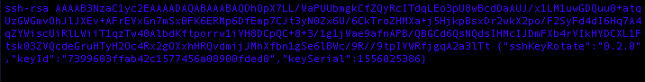

# sshKeyRotate

Script to automate the rotation of ssh keys on remote linux hosts.

Partial reimplementation of the "ssh-copy-id" script, with corrections and enhancements where possible.

## Working Principle

The script runs the following sequence:

1. Generate a new PKA key pair
2. Copy the public key to the `~/.ssh/authorized_keys` file on the remote host (remote directory and file will be created if necessary)
3. Connect to the remote host using the new private key to assess the validity of the new PKA key pair
4. Delete all old related public keys in the `~/.ssh/authorized_keys` file on the remote host
5. Copy the new private key to the local `~/.ssh/config` file (local directory and file will be created if necessary)

Related keys are identified using the comment section of the public key and according to the following json structure:
    `{"sshKeyRotate":"0.0.0","keyId":"abc","keySerial":123}`

Where:
* "sshKeyRotate" contains the version of this script at time of execution
* "keyId" contains the hash of the string "local_user@local_host remote_user@remote_host"
* "keySerial" contains the Epoch seconds at time of creation of the new PKA key pair

Example of `~/.ssh/authorized_keys` file:

## Getting Started

1. Download the sshKeyRotate.sh file or copy-paste its raw content to a file called `sshKeyRotate.sh`
2. Make the file executable `chmod +x ./sshKeyRotate.sh`
3. Run the executable file `./sshKeyRotate.sh -u xxx -h yyy`

Use argument "-h" `./sshKeyRotate.sh -h` to list all available command-line arguments.

## Command-line Arguments

* -u|--user <xxx>: remote user (required)
* -h|--host <xxx>: remote host (required)
* -t|--type <xxx>: PKI key pair generation algorythm (default: 'rsa')
* -b|--bits <000>: key size (default: 2048)
* -c|--command <xxx>: initial command to run on remote host once connected (default: none)
* -v|--verbose: enable verbosity
* -V|--version: print the script's version
* -H|--help: help message

## Contributing

All contributions are welcome.

## Versioning

The versioning scheme is fully [SemVer v2.0.0](https://semver.org/spec/v2.0.0.html) compliant.

## License

This project is licensed under the GNU General Public License v3.0 - see the [LICENSE.md](LICENSE.md) file for details.
